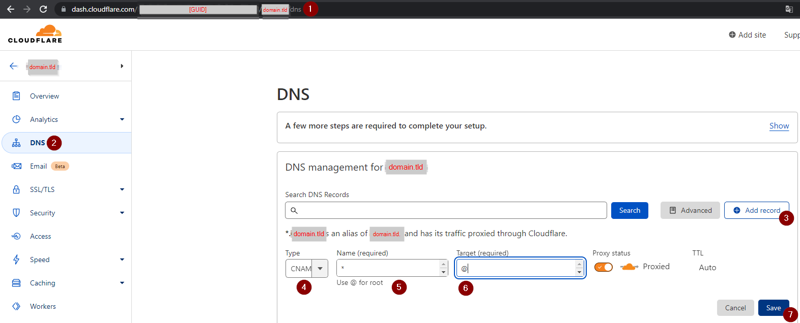

# velociraptor-docker
Run [Velocidex Velociraptor](https://github.com/Velocidex/velociraptor) server with Docker and a reverse proxy (Traefik), utilizing CloudFlare DNS and Let's Encrypt certificates.  
Credit to [weslambert](https://github.com/weslambert/velociraptor-docker) for the docker image.

#### Prereqs
1. Cloudflare account (required for Let's Encrypt Certificates and creating DNS entries)
2. Create wildcard(*) CNAME for the root of your domain

4. Create API token with permissions Zone.Zone Settings, Zone.Zone, Zone.DNS
   - Make sure to copy token as it is only displayed once
5. Create API key

#### Configuration:
##### This installs all dependacies and Docker/Docker Compose.
1. `cd /docker-velo/scripts`
2. run `./install.sh` # WILL PROMPT FOR SUDO PASSWORD IF NEEDED
3. Script will prompt you for Domain Name, Cloudflare email address, cloudflare API key and Token.

#### Create 1st and Nth Velo instance(s)
1. `./addnew.sh`
2. Enter name of instance, this will be used to create the sub domain entering `test` will give you `test-velo.$DOMAINNAME` and your docker instance will be named `test-velo`
3. It will ask you to enter in the Admin username you want to use, it will auto generate a password and display it at end of script.
4. once completed it will spit out username and password for the instance and you will be able to browse and login to your new instance.
### When it completes, you should be able to go to https\://dns entry.domain

#### Remove an instance
1. in scripts folder run `./remove.sh`
2. it will ask you the name of the instance, ie: if instance name is `test-velo`, you simply enter `test`.
